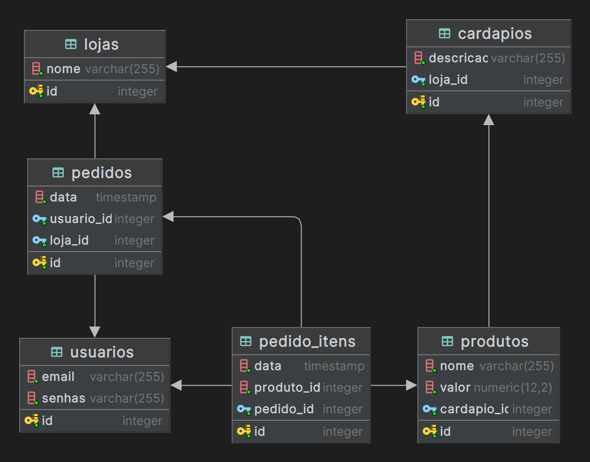

# Cardapio API

### Este projeto consiste em uma API REST em PHP, implementado sem uso nenhum de Framework, somente a linguagem pura e bibliotecas básicas.

> Este projeto é destinado para a fins educativos

### Estrutura do banco de dados


### Criando banco de dados
```sh
docker exec -i cardabip-db psql -U postgres -d cardapio < src/database/queries/create_schema.sql
```

## Referencias
[PADRÕES DE PROJETO - O catálogo dos exemplos PHP](https://refactoring.guru/pt-br/design-patterns/php)